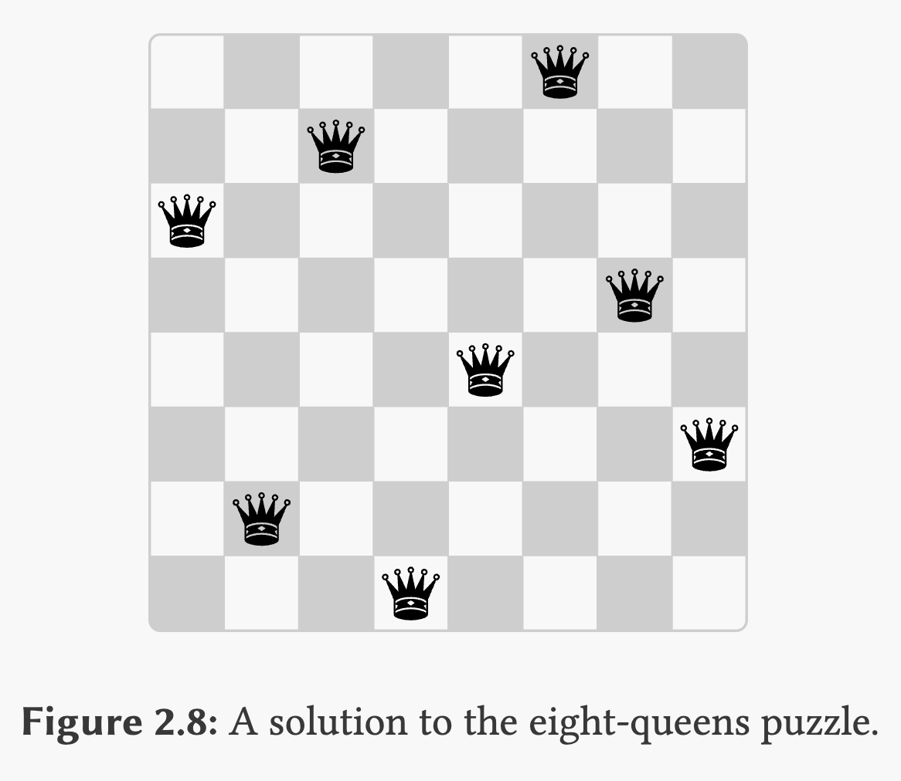

## Exercise 2.42

The “eight-queens puzzle” asks how to place eight queens on a chessboard so that
no queen is in check from any other (i.e., no two queens are in the same row,
column, or diagonal). One possible solution is shown in
[Figure 2.8.](#figure-2.8) One way to solve the puzzle is to work across the
board, placing a queen in each column. Once we have placed $k−1$ queens, we must
place the $k^{th}$ queen in a position where it does not check any of the queens
already on the board. We can formulate this approach recursively: Assume that we
have already generated the sequence of all possible ways to place $k−1$ queens
in the first $k−1$ columns of the board. For each of these ways, generate an
extended set of positions by placing a queen in each row of the $k^{th}$ column.
Now filter these, keeping only the positions for which the queen in the $k^{th}$
column is safe with respect to the other queens. This produces the sequence of
all ways to place $k$ queens in the first $k$ columns. By continuing this
process, we will produce not only one solution, but all solutions to the puzzle.

<h1 id="figure-2.8" style="margin:0; padding:0;"></h2>



We implement this solution as a procedure `queens`, which returns a sequence of
all solutions to the problem of placing $n$ queens on an $n \times n$
chessboard. `Queens` has an internal procedure `queen-cols` that returns the
sequence of all ways to place queens in the first $k$ columns of the board.

```scheme
(define (queens board-size)
  (define (queen-cols k)
    (if (= k 0)
        (list empty-board)
        (filter
         (lambda (positions)
           (safe? k positions))
         (flatmap
          (lambda (rest-of-queens)
            (map (lambda (new-row)
                   (adjoin-position
                    new-row
                    k
                    rest-of-queens))
                 (enumerate-interval
                  1
                  board-size)))
          (queen-cols (- k 1))))))
  (queen-cols board-size))
```

In this procedure `rest-of-queens` is a way to place $k−1$ queens in the first
$k−1$ columns, and `new-row` is a proposed row in which to place the queen for
the $k^{th}$ column. Complete the program by implementing the representation for
sets of board positions, including the procedure `adjoin-position`, which
adjoins a new row-column position to a set of positions, and `empty-board`,
which represents an empty set of positions. You must also write the procedure
`safe?`, which determines for a set of positions, whether the queen in the
$k^{th}$ column is safe with respect to the others. (Note that we need only
check whether the new queen is safe—the other queens are already guaranteed safe
with respect to each other.)

## Solution

For our representation we decided to add new queens at the HEAD instead of the
TAIL. Why? Because if we append new positions at the end, to access the most
recent queen we to traverse the whole list, making `adjoin-position` $O(n)$,
while it could be $O(1)$ if we store the new queen at the HEAD.

```scheme
(define empty-board '())

(define (make-position row col)
  (cons row col))

(define position-row car)

(define position-col cdr)

(define (adjoin-position row col positions)
  ; New position is always added to the HEAD
  (cons (make-position row col) positions))

(define (safe? col-added positions)
  (define row-added (position-row (car positions)))
  (define (is-same-row? position)
    (= (position-row position) row-added))
  (define (is-same-diagonal? position)
    (= (abs (- (position-row position) row-added))
       (abs (- col-added (position-col position)))))
  (define (check remaining-positions)
    (cond ((null? remaining-positions) #t)
          ((is-same-row? (car remaining-positions)) #f)
          ((is-same-diagonal? (car remaining-positions)) #f)
          (else (check (cdr remaining-positions)))))
  (check (cdr positions)))

(define (queens board-size)
  (define (queen-cols k)
    (if (= k 0)
        (list empty-board)
        (filter
         (lambda (positions)
           (safe? k positions))
         (flatmap
          (lambda (rest-of-queens)
            (map (lambda (new-row)
                   (adjoin-position
                    new-row
                    k
                    rest-of-queens))
                 (enumerate-interval
                  1
                  board-size)))
          (queen-cols (- k 1))))))
  (queen-cols board-size))
```

Note that this solution has `safe?` implemented in a "imperative" style. Another
way, we could implement safe, but rather in a slightly more "declarative" way
would be:

```scheme
(define empty-board '())

(define (make-position row col)
  (cons row col))

(define position-row car)

(define position-col cdr)

(define (adjoin-position row col positions)
  ; New position is always added to the HEAD
  (cons (make-position row col) positions))

(define (every pred lst)
  (cond ((null? lst) #t)
        ((pred (car lst)) (every pred (cdr lst)))
        (else #f)))

(define (safe? col positions)
  (define (attacking? q1 q2)
    (let ((r1 (position-row q1))
          (c1 (position-col q1))
          (r2 (position-row q2))
          (c2 (position-col q2)))
      (or (= r1 r2)
          (= (abs (- r1 r2))
             (abs (- c1 c2))))))
  (define new-queen (car positions))
  (every (lambda (queen) (not (attacking? new-queen queen)))
         (cdr positions)))

(define (queens board-size)
  (define (queen-cols k)
    (if (= k 0)
        (list empty-board)
        (filter
         (lambda (positions)
           (safe? k positions))
         (flatmap
          (lambda (rest-of-queens)
            (map (lambda (new-row)
                   (adjoin-position
                    new-row
                    k
                    rest-of-queens))
                 (enumerate-interval
                  1
                  board-size)))
          (queen-cols (- k 1))))))
  (queen-cols board-size))
```
