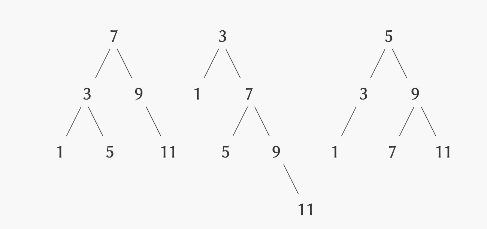

## Exercise 2.63

Each of the following two procedures converts a binary tree to a list.

```scheme
(define (tree->list-1 tree)
  (if (null? tree)
      '()
      (append
       (tree->list-1
        (left-branch tree))
       (cons (entry tree)
             (tree->list-1
              (right-branch tree))))))

(define (tree->list-2 tree)
  (define (copy-to-list tree result-list)
    (if (null? tree)
        result-list
        (copy-to-list
         (left-branch tree)
         (cons (entry tree)
               (copy-to-list
                (right-branch tree)
                result-list)))))
  (copy-to-list tree '()))
```

1. Do the two procedures produce the same result for every tree? If not, how do
   the results differ? What lists do the two procedures produce for the trees in
   Figure 2.16?

 _Figure 2.16_

2. Do the two procedures have the same order of growth in the number of steps
   required to convert a balanced tree with $n$ elements to a list? If not,
   which one grows more slowly?

## Solution

1.  Yes, the two procedures produce the same result for every tree. In
    particular, the first performs an in-order traversal and appends
    intermediate results (left to right), while the second performs a reverse
    in-order traversal and preprends elements to the result (right to left).

    |        | tree->list-1     | tree->list-2     |
    | ------ | ---------------- | ---------------- |
    | Tree 1 | `(1 3 5 7 9 11)` | `(1 3 5 7 9 11)` |
    | Tree 2 | `(1 3 5 7 9 11)` | `(1 3 5 7 9 11)` |
    | Tree 3 | `(1 3 5 7 9 11)` | `(1 3 5 7 9 11)` |

2.  - `tree->list-1` runs in $Θ(n \log n)$ for balanced trees, because each
      internal node performs an `append` that copies a list whose size is
      proportional to the size of the node's left subtree.
    - `tree->list-2` runs in $Θ(n)$, because it builds the list by simple
      consing without any list copying.
    - Therefore `tree->list-2` is asymptotically faster, even for balanced
      trees.
