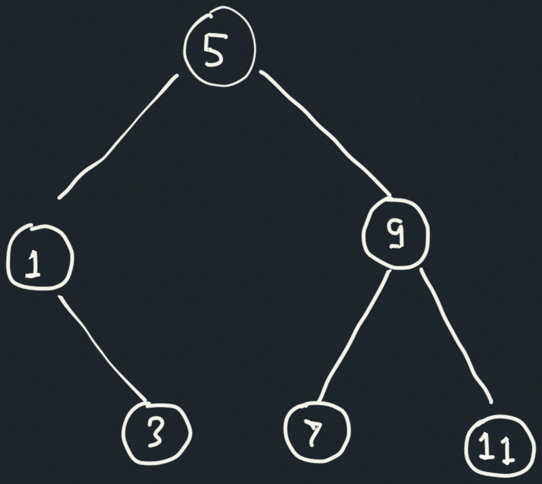

## Exercise 2.64

The following procedure `list->tree` converts an ordered list to a balanced
binary tree. The helper procedure `partial-tree` takes as arguments an integer
$n$ and list of at least $n$ elements and constructs a balanced tree containing
the first $n$ elements of the list. The result returned by `partial-tree` is a
pair (formed with `cons`) whose `car` is the constructed tree and whose `cdr` is
the list of elements not included in the tree.

```scheme
(define (list->tree elements)
  (car (partial-tree
        elements (length elements))))

(define (partial-tree elts n)
  (if (= n 0)
      (cons '() elts)
      (let ((left-size
             (quotient (- n 1) 2)))
        (let ((left-result
               (partial-tree
                elts left-size)))
          (let ((left-tree
                 (car left-result))
                (non-left-elts
                 (cdr left-result))
                (right-size
                 (- n (+ left-size 1))))
            (let ((this-entry
                   (car non-left-elts))
                  (right-result
                   (partial-tree
                    (cdr non-left-elts)
                    right-size)))
              (let ((right-tree
                     (car right-result))
                    (remaining-elts
                     (cdr right-result)))
                (cons (make-tree this-entry
                                 left-tree
                                 right-tree)
                      remaining-elts))))))))
```

1. Write a short paragraph explaining as clearly as you can how `partial-tree`
   works. Draw the tree produced by `list->tree` for the list `(1 3 5 7 9 11)`.

2. What is the order of growth in the number of steps required by `list->tree`
   to convert a list of $n$ elements?

## Solution

### 1. How `partial-tree` works

The procedure `partial-tree` works by partioning the first `n` elements of
`elts` around a central element, recursively building left and right subtrees.
Because we always return a pair whose `car` is the constructed tree, and the
`cdr` is the list of elements not included in the tree, we can use the `cdr` to
continue building the subtrees instead of re-traversing the entire list.

1.  If `n = 0`, return the empty tree and the full list unchanged:
    `(cons '() elts)`
2.  Otherwise:
    1. Compute `left-size = quotient((n-1), 2)`. This is the number of nodes to
       go into the left subtree
    2. Recursivelly call `(partial-tree elts left-size)` to build the left
       subtree from the first `left-size` elements. That call returns a pair
       whose `car` is the left subtree and whose `cdr` is the list of elements
       remaining after consuming those `left-size` entries.
    3. Let `this-entry` be the first element of that remaining list
    4. Compute `right-size = n - (left-size + 1)` and recursively build the
       right subtree from the tail of the remaining list.
    5. Finally, create a tree node with `this-entry`, `left-tree`, and
       `right-tree`, and return that tree paired with the leftover list after
       consuming all `n` elements.

The tree produced for the list `(1 3 5 7 9 11)` is:



### 2. Order of growth

`partial-tree` performs a constant amount of work at each node (`car`/`cdr`/
`cons`), and the recursive calls partition the `n` elements into left and right
subproblems whose sizes sum to `n-1`. If $T(n)$ is the work to build a tree of
size $n$,

$$
T(n) = T(\text{left-size}) + T(\text{right-size}) + Θ(1),
$$

and for a balanced split
$\text{left-size} \approx \text{right-size} \approx n/2$, this recurrence solves
to

$$
T(n) = Θ(n)
$$
