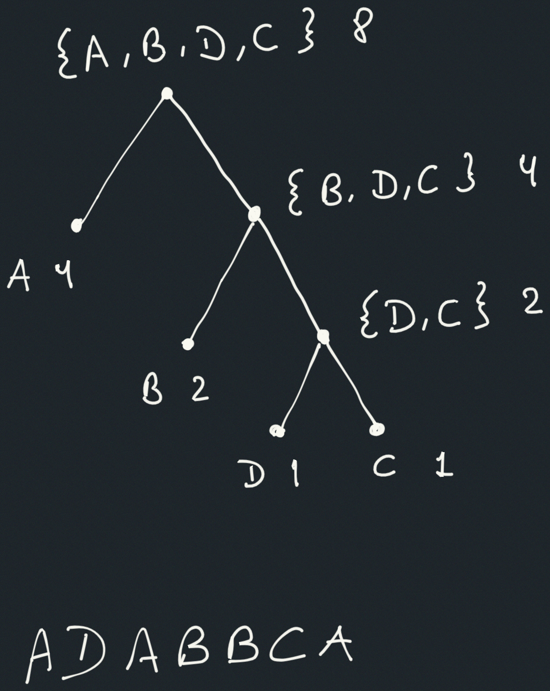

## Exercise 2.67

Define an encoding tree and a sample message:

```scheme
(define sample-tree
  (make-code-tree
   (make-leaf 'A 4)
   (make-code-tree
    (make-leaf 'B 2)
    (make-code-tree
     (make-leaf 'D 1)
     (make-leaf 'C 1)))))

(define sample-message
  '(0 1 1 0 0 1 0 1 0 1 1 1 0))
```

Use the `decode` procedure to decode the message, and give the result.

## Solution

First we write the procedures, following the book's implementation:

```scheme
(define (make-leaf symbol weight)
  (list 'leaf symbol weight))

(define (symbol-leaf leaf) (cadr leaf))
(define (weight-leaf leaf) (caddr leaf))

(define (leaf? object)
  (eq? (car object) 'leaf))

(define (make-code-tree left right)
  (list left
        right
        (append (symbols left) (symbols right))
        (+ (weight left) (weight right))))

(define (left-branch tree) (car tree))
(define (right-branch tree) (cadr tree))

(define (symbols tree)
  (if (leaf? tree)
    (list (symbol-leaf tree))
    (caddr tree)))

(define (weight tree)
  (if (leaf? tree)
    (weight-leaf tree)
    (cadddr tree)))

(define (decode bits tree)
  (define (choose-branch bit branch)
    (cond ((= bit 0) (left-branch branch))
          ((= bit 1) (right-branch branch))
          (else (error "bad bit:
                       CHOOSE-BRANCH" bit))))
  (define (decode-1 current-bits current-branch)
    (if (null? current-bits)
      '()
      (let ((next-branch (choose-branch (car current-bits)
                                        current-branch)))
        (if (leaf? next-branch)
          (cons (symbol-leaf next-branch)
                (decode-1 (cdr current-bits) tree))
          (decode-1 (cdr current-bits) next-branch)))))
  (decode-1 bits tree))

(define sample-tree
  (make-code-tree
   (make-leaf 'A 4)
   (make-code-tree
    (make-leaf 'B 2)
    (make-code-tree
     (make-leaf 'D 1)
     (make-leaf 'C 1)))))

(define sample-message
  '(0 1 1 0 0 1 0 1 0 1 1 1 0))
```

Now we can draw the Huffman tree, and the expected decoded message:



```
> (decode sample-message sample-tree)
(A D A B B C A)
```
