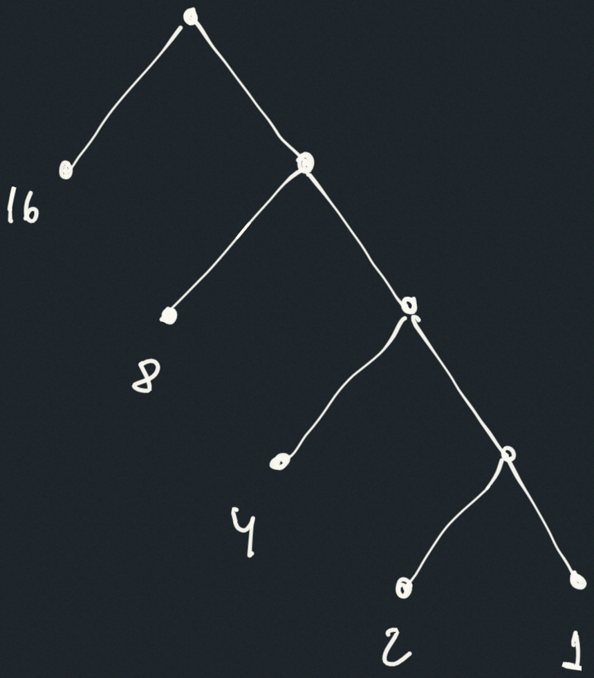
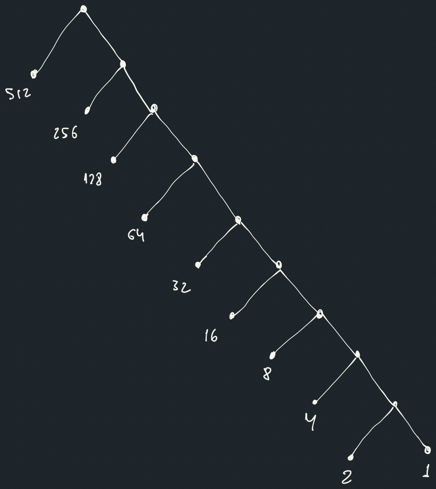

## Exercise 2.71

Suppose we have a Huffman tree for an alphabet of $n$ symbols, and that the
relative frequencies of the symbols are $1,2,4,…,2^{n−1}$ . Sketch the tree for
$n=5$ ; for $n=10$ . In such a tree (for general $n$) how many bits are required
to encode the most frequent symbol? The least frequent symbol?

## Solution

Sketch for $n = 5$

Sketch for $n = 10$

The tree looks like this because the merging algorithm ends up accumulating
everything into one tree. At each stage, the weight of the tree is less than the
weight of the next leaf. For example:

$$
1 + 2 < 4
$$

And in general

$$
2^0 + ... + 2^{k-1} = 2^k - 1 < 2^k
$$

In other words, after merging the smallest $k$ leaves, the resulting subtree has
weight $2^k - 1$, which is always strictly less than the next leaf’s weight
$2^k$.

In this encoding, the most frequent symbol requires one bit (just move from the
root to the left) and the least frequent symbol requires $n-1$ bits (just move
from the root until the deepest end of the chain).

- Most frequent symbol: depth $= 1$
- Least frequent symbol: depth $= n - 1$
