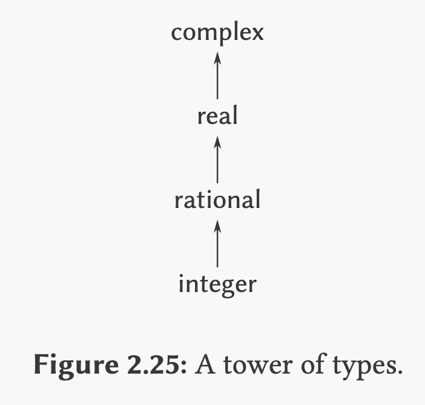

## Exercise 2.83

Suppose you are designing a generic arithmetic system for dealing with the tower
of types shown in [Figure 2.25](#figure-2.25): integer, rational, real, complex.
For each type (except complex), design a procedure that raises objects of that
type one level in the tower. Show how to install a generic `raise` operation
that will work for each type (except complex).

<h1 id="figure-2.25" style="margin:0; padding:0;"></h2>



## Solution

Until now we had the `scheme-number` package. Now, we need to split it into
`integer` and `real`, and install them:

```scheme
(define (install-integer-package)
  (define (tag x) (attach-tag 'integer x))
  (put 'add '(integer integer) (lambda (x y) (tag (+ x y))))
  (put 'sub '(integer integer) (lambda (x y) (tag (- x y))))
  (put 'mul '(integer integer) (lambda (x y) (tag (* x y))))
  (put 'div '(integer integer) (lambda (x y) (tag (/ x y))))
  (put 'make 'integer (lambda (x) (tag x)))
'done)

(install-integer-package)

(define (install-real-package)
  (define (tag x) (attach-tag 'real x))
  (put 'add '(real real) (lambda (x y) (tag (+ x y))))
  (put 'sub '(real real) (lambda (x y) (tag (- x y))))
  (put 'mul '(real real) (lambda (x y) (tag (* x y))))
  (put 'div '(real real) (lambda (x y) (tag (/ x y))))
  (put 'make 'real (lambda (x) (tag x)))
'done)

(install-real-package)
```

Now we can define, the `raise` procedure for each package, and its corresponding
generic procedure in the arithmetic package:

```diff
(define (install-integer-package)
  ;; ...
+  (define (integer->rational x)
+    (make-rational x 1))
+  (put 'raise '(integer) integer->rational)
'done)

(define (install-rational-package)
  ;; ...
+  (define (rational->real x)
+    (make-real (inexact (/ (numer x) (denom x)))))
+  (put 'raise '(rational) rational->real)
'done)


(define (install-real-package)
  ;; ...
+  (define (real->complex x)
+    (make-complex-from-real-imag x 0))
+  (put 'raise '(real) real->complex)
'done)

+(define (raise n)
+  (apply-generic 'raise n))
```

Notice that inside a package we are crossing the package boundary (for example
when we call `make-rational` inside `install-integer-package`). At first this
could be seem as a violation, but it is not actually true. Constructors like
`make-rational`, `make-real`, `make-complex-from-real-imag` are intentionally
exported. We are not breaking encapsulation, we are using the public interface.
